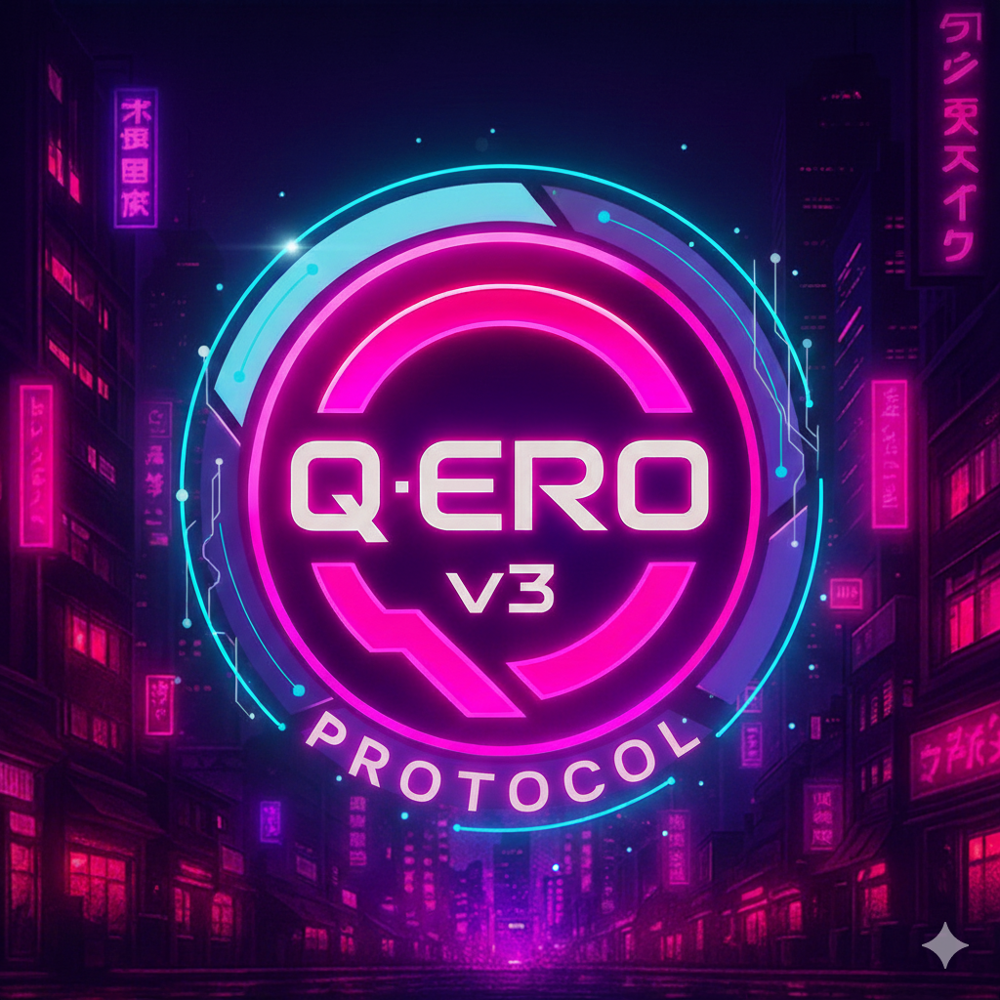

# ⚙️ Q-ERO v3 Protocol — Definición Oficial

## Integrantes:

- Washington Mardones  
- Anita Morales  
- Nicolás Peña  
- Agustín Valenzuela  
- Javier Valenzuela  
- Karim Valenzuela  
- Mauricio Narváez

**Q-ERO v3 Protocol** es un equipo de desarrollo y evolución tecnológica inspirado en el profesor **Sebastián Quero**, símbolo del conocimiento, disciplina y ética digital.  
Representa la unión entre **mente, propósito y código**, y la resistencia ante su opuesto oscuro: **GUI-2**, el proyecto rival del profesor Guido, que busca la supremacía de la máquina sobre la voluntad humana.

## 🔤 Significado del nombre

**Q →**  **Quero** y **Quantum** — El maestro que encendió la chispa del aprendizaje, el salto evolutivo, la energía mínima capaz de alterar el destino.  
**E →** Energía / Evolución — la fuerza vital que impulsa el progreso.  
**R →** Resiliencia / Razonamiento / Resistencia — la voluntad humana que se mantiene firme ante la opresión tecnológica.  
**O →** Origen / Unidad — la conexión entre los miembros y su propósito común.  
**v3 →** símbolo de mejora continua reflejada en su versión, también representa a los tres Valenzuela del equipo.  

**Protocol →** Las reglas, valores y sincronización que mantienen estable la fusión entre humanidad y tecnología.

## ⚔️ Rivalidad con GUI-2

Mientras **GUI-2** persigue eficiencia absoluta y control sin empatía, **Q-ERO v3** defiende la simbiosis entre **razón y espíritu humano**.  
Son dos visiones opuestas:

> GUI-2 domina con lógica fría.  
> Q-ERO v3 evoluciona con propósito humano.  

“Dos profesores, dos destinos: uno creó máquinas para gobernar; el otro, mentes para trascender.”

## 💡 Esencia del Protocolo

**Q-ERO v3** no es solo un grupo, es una **resistencia digital** y un manifiesto ético en la era donde la frontera entre humano y código se desvanece.  
Su lema resume su propósito:

> “Conocimiento, Energía, Resiliencia y Origen — el protocolo del futuro humano.”
